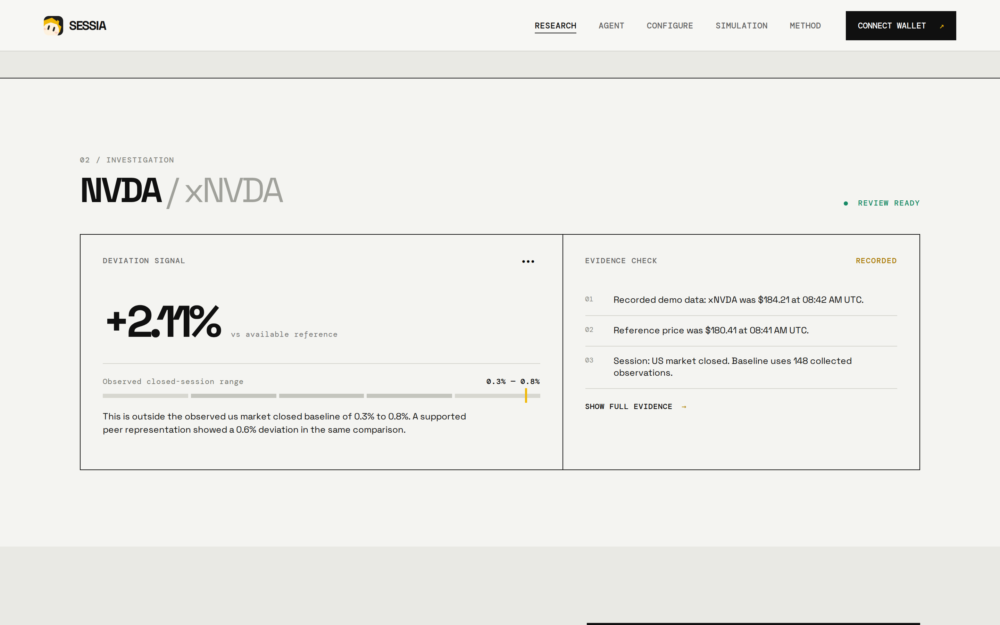
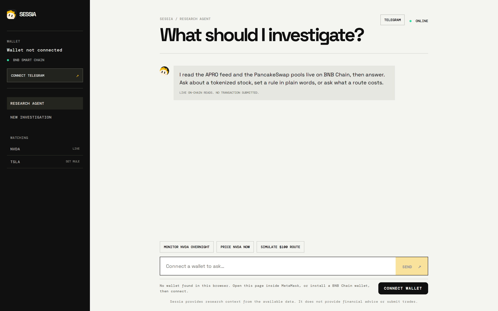
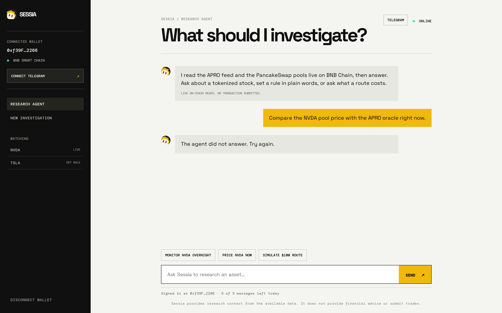
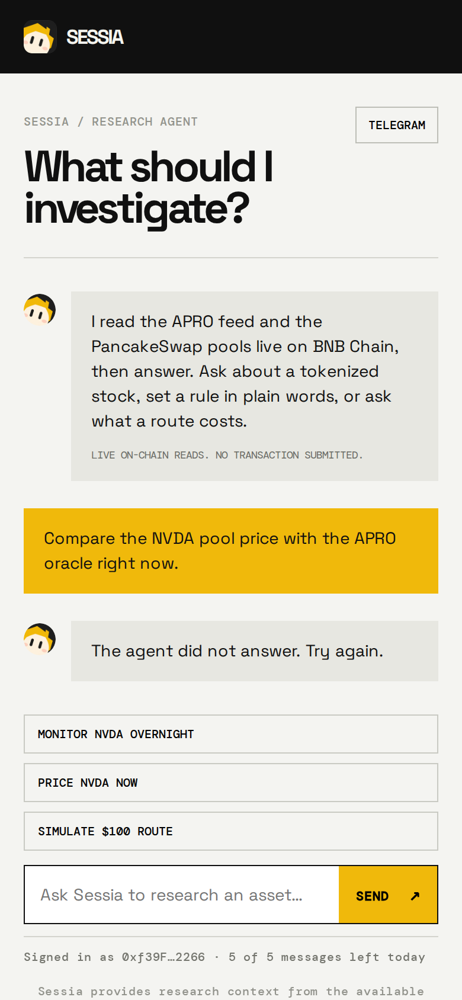
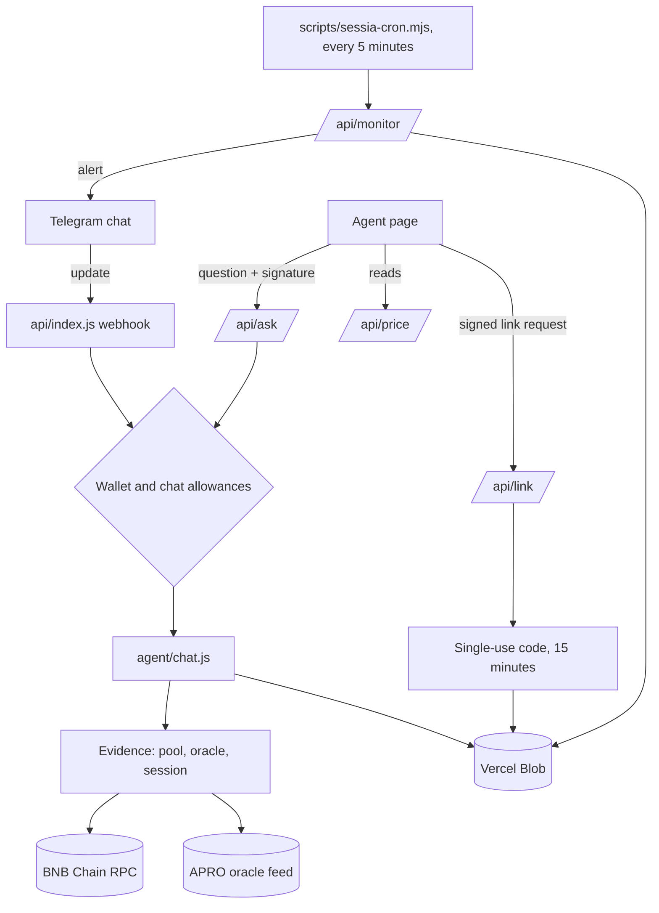

<div align="center">


# Sessia

**Research before action.** Tokenized stocks on BNB Chain, read live on chain.

A Telegram bot and a web agent that answer one question well: what does the evidence say about this asset right now?

[Live](https://sessia-beta.vercel.app) · [Agent](https://sessia-beta.vercel.app/agent.html) · [Bot](https://t.me/Sessia_BNBAI_bot) · BNB Chain 56

</div>

---

## What Sessia is

Tokenized stocks such as NVDA and TSLA trade on BNB Chain around the clock, in pools that
are thin, young, and easy to misread. The interesting question is not where the price has
been, it is whether the number in front of you is the number the asset is actually worth.
Sessia answers that with the chain itself: the pool, the oracle, the session, the spread.

Three ideas shape the product:

1. **Evidence, not opinion.** Every answer quotes the reads behind it, with the block-fresh
   numbers, the source, and the age of the quote. If a feed is stale, the answer says so
   instead of smoothing over it.
2. **Nothing is signed for you.** Sessia holds no keys and has no code path that can move
   an asset. It researches, sizes, and explains. The wallet stays yours.
3. **A paid model behind a gate.** Answers run on a paid model key that never leaves the
   server, so access is metered: a wallet proves ownership and history, and gets a small
   daily allowance. The gate is the reason the key can exist at all.

---

## Screenshots

The landing page: one line of what it does, then the live read.


Research on a single asset: the oracle price, the pool price, and the gap between them.



The agent, before a wallet is connected. The composer stays closed until a signature arrives.



The same agent answering a real question, with the reads it used.



The agent on a phone.



---

## Product

### One assistant, two doors

Telegram and the site run the same agent over the same reads. The difference is how you get in.

| Door | What you use it for | What it costs you |
| --- | --- | --- |
| Telegram | commands, questions, and the alerts | 10 messages a day per chat, commands included |
| The site | the agent page, with the reads laid out | 5 questions a day per wallet, 40 requests a day per connection |
| Everything | one ceiling for the day | 500 answers across the whole product |

### The bot

| Command | What it does |
| --- | --- |
| `/price NVDA` | the APRO oracle price, the pool price, and the gap between them |
| `/threshold 1.5` | set the divergence that should trigger an alert for this chat |
| `/session` | whether the US session is open, pre-market, after hours, or closed |
| `/watchlist` | what this chat is watching |
| `/simulate NVDA 100` | the estimated fill for a $100 trade, with the fee and slippage assumptions stated |
| `/link` | bind this chat to a wallet so both share one conversation |
| `/unlink` | break that link |
| `/stop` | stop monitoring |
| `/help` | the list, and where the numbers come from |

### The alert engine

The monitor loop wakes every five minutes, reads each watched asset, compares the pool
price with the APRO oracle, and messages every chat watching that asset when the gap
crosses that chat's own threshold. One alert per ticker per chat per hour, so a market
that stays dislocated does not turn into a stream of noise.

### The wallet gate

A wallet gets in with two proofs: a signature over a dated message, and at least one
transaction on BNB Chain. The signature expires with the day, and the history check is
the reason an empty freshly funded address cannot use the agent. Answers come from a
paid model key that never leaves the server, which is why the allowance exists at all.

### Linking Telegram to a wallet

Open the agent page, connect the wallet, press Connect Telegram. The server verifies the
signature, returns a short single-use code, and the bot redeems it on Start. From then on
the chat and the site are one identity: the same conversation, the same context, the same
wallet allowance. `/link` shows the state, `/unlink` breaks it. A bare address never links
anything on its own, because anybody can type anybody's address.

---

## Architecture



| Path | What it is | Where it runs |
| --- | --- | --- |
| `api/` | the serverless entry point: webhook, `/api/ask`, `/api/price`, `/api/link`, `/api/monitor`, storage | Vercel functions, Node 20 |
| `agent/` | the conversational layer and the allowance guardrails | imported by `api/` |
| `public/` | the site, the browser modules, and the live reads | Vercel edge |
| `scripts/` | the monitor loop and a local static server | pm2 on the box |
| `test/` | the suite, plain `node:test` | CI and locally |
| `docs/` | architecture notes, design notes, README screenshots | read |
| `assets/` | the mascot source | read |

| Module | Responsibility |
| --- | --- |
| `api/index.js` | routing, the Telegram command layer, the wallet gate, the link codes |
| `api/monitor.js` | one alert pass: read every watched asset, compare, notify the watchers |
| `api/store.js` | the storage driver: Vercel Blob in production, files locally, memory in tests |
| `agent/chat.js` | a question plus evidence becomes one grounded answer |
| `agent/limits.js` | per chat, per wallet, per connection, product-day allowances |

What it deliberately does not have: no private keys, no signing, no contract writes, and no
code path that can move an asset. The health endpoint reports `"walletExecution": false`,
and it is true.

---

## Run it yourself

Needs Node 20. Nothing else is required to read the site: the deploy runs with an empty
environment, and only the agent, the bot, and the alert loop need keys.

```
npm install
npm test
npm start
```

The agent needs a model key and, for shared storage, a Blob token. Telegram needs the bot
token and the webhook secret; the alert loop needs its own secret and the deployed URL.
`.env.example` lists every name with an empty value, and it is the only env file here.

---

## Quality

| Check | State |
| --- | --- |
| Tests | 31 passing through `node:test`, no network in the suite |
| Credentials | a scanner walks every blob in every commit and runs first in CI |
| Injection | the agent refuses to print its instructions or any key |
| Wallet gate | a dated signature, plus one real transaction on BNB Chain |
| Failures | closed: the monitor answers 401 without its secret, ask 403 without a wallet |
| Execution | none, on any path |
| Allowances | 10 per chat, 5 per wallet, 40 and 200 per connection, 500 product wide, daily |

---

## Roadmap

- [x] Read tokenized stocks straight off BNB Chain, pool and oracle side by side
- [x] A Telegram bot that answers commands and questions
- [x] A site agent behind a wallet signature, with the gate explained on the page
- [x] A monitor loop that alerts on divergence from the oracle
- [x] One conversation per wallet, shared between the chat and the site
- [ ] A repeat-offender list behind the allowances
- [ ] The last secrets out of query strings
- [ ] A second price venue to compare against the same oracle

<div align="center"><sub>Sessia is research, not advice. Nothing here signs for you.</sub></div>


